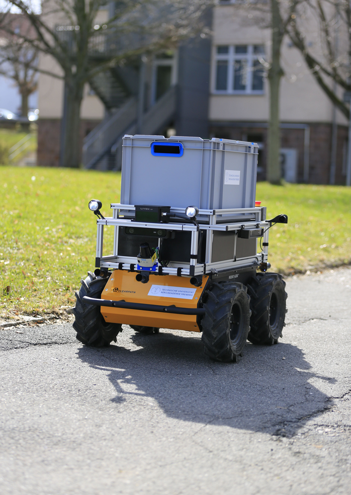
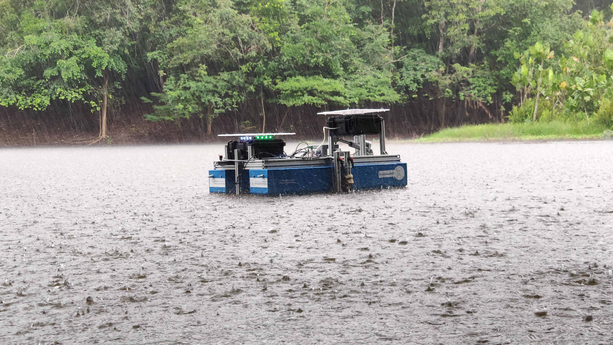

<!--

author:   Sebastian Zug & André Dietrich
email:    zug@ovgu.de   & andre.dietrich@ovgu.de
version:  0.0.3
language: de
narrator: Deutsch Female

import:   https://github.com/liascript/CodeRunner
-->

[](https://liascript.github.io/course/?https://raw.githubusercontent.com/SebastianZug/CampusTag/main/README.md#1)

# Sächsiche Informatik-Wettbewerb 2025

|      |      |
| <!-- style="width: 100%" -->     | <h2> Bergbau & Informatik? </h2>  oder    <h2> Innovative Formate der IT-Wissensvermittlung an der TU
Freiberg </h2>                                |

------------------------------

<h4>Prof. Dr. Sebastian Zug, Institut für Informatik, Technische Universität Bergakademie Freiberg</h4>

------------------------------

## Informatik an der TUBAF

> Welche Themenfelder werden an der TUBAF in der [Informatik](https://tu-freiberg.de/fakultaet1/institut-fuer-informatik) behandelt?

+ Professur für Ubiquitous Computing and Smart Systems
+ Professur für Virtuelle Realität und Multimedia
+ Professur für Künstliche Intelligenz und Datenbanken
+ Professur für Softwaretechnologie und Robotik

> Die Forschungsaktivitäten zielen neben eigenen Schwerpunkten insbesondere auf Softwarlösungen für interdisziplinäre Forschungsprojekte ab, die in der Regel in Kooperation mit anderen Instituten der TUBAF oder externen Partnern durchgeführt werden.




## Innovative Lehre

<!-- style="background-color: #eeeeee" -->
> Worum soll es heute nicht gehen? 


### Vorlesungen

<!-- style="background-color: #eeeeee" -->
> __Traditionell:__ _"... Vorlesungen fallen in die Kategorie Frontalunterricht, bei dem meist mehrere hundert Studenten dem Vortrag eines Professors zuhören. In einigen Fällen liest dieser aus einem Skript oder von Folien vor. ... Daher kann es vorkommen, dass man sich während der Vorlesung ergänzende Notizen zum Vorgetragenen machen muss."_ 
>
> (Quelle: https://www.studieren.at/uni-abc/vorlesung/)

> __TUBAF:__ "Vorlesungen werden Lernrziel orientiert gestaltet und bieten den Studierenden die Möglichkeit, aktiv am Lehrprozess teilzunehmen. Die Vorlesungen sind interaktiv und fördern den Austausch zwischen Studierenden und Dozenten."


<details>

<summary>**Interaktives Programmieren**</summary>

```python BuggyCode.py
text = "Sächischer Informatikwettbewerb 2025"

count = input("Wie oft wollen Sie den Text ausgeben")
print(count)

for i in range(count):
  print(text, end = " ")
```
@LIA.eval(`["main.py"]`, `none`, `python3 main.py`)

</details>

<details>

<summary>**Skripte als Open Educational Ressources**</summary>

> Übersicht zu Vorlesungsinhalten der Informatik/Robotik Grundlagen unter [Link](https://github.com/TUBAF-IfI-LiaScript)

!?[](https://github.com/TUBAF-IfI-LiaScript/.github/assets/10922356/00a24602-dc63-4b9a-894b-80967b914513)

</details>

<details>

<summary>**"Extraaufgaben"**</summary>

In der Vorlesung werden die Extraaufgaben als praktische Beiträge der Studierenden vorbereitet, die damit ihre Fähigkeit trainieren, wissen strukturiert weiterzugeben.


</details>


### Übungen 

<!-- style="background-color: #eeeeee" -->
> __Traditionell:__ _"Übungen dienen der praktischen Anwendung von theoretisch erlerntem Wissen. In der Regel werden sie als Pflichtveranstaltung ergänzend zu einer Vorlesung angeboten. Übungen sind prüfungsimmanent, was bedeutet, dass neben Anwesenheitspflicht die aktive Teilnahme der Studierenden vorausgesetzt wird. Ob und in welcher Form (Referat, schriftliche Ausarbeitung, Klausur) eine zusätzliche Leistung zum Abschluss einer Übung erbracht werden muss, wird von jedem Institut einzeln festgelegt."_ 
>
> (Quelle: https://www.studieren.at/uni-abc/vorlesung/)

> __TUBAF:__ "Neben dem konkreten inhaltlichen Verständnis müssen Übungen auch immer relevanten Arbeitsmuster vermitteln."

<details>
<summary>**Teamarbeit**</summary>

")

</details>

<details>
<summary>**"Remote-Labore"**</summary>


</details>


### Seminare 

<!-- style="background-color: #eeeeee" -->
> __Traditionell:__ _"Ein Seminar dient der vertiefenden Auseinandersetzung mit einem Thema. In der Regel baut ein Seminar auf einer zuvor besuchten Vorlesung oder einem Proseminar auf.  ... Seminare sind prüfungsimmanente Lehrveranstaltungen, was bedeutet, dass Anwesenheitspflicht herrscht und Studenten aufgefordert sind, sich aktiv an Diskussionen und durch Referate zu beteiligen."_ 
>
> (Quelle: https://www.studieren.at/uni-abc/vorlesung/)

> __TUBAF:__ "Insbesondere die Seminare betten die Studierenden in aktuelle Forschungsprojekte ein und bieten ihnen die Möglichkeit, sich einzubringen."

<details>
<summary>__"Forschungsfokus auf unterschiedlichen Ebenen"__</summary>

| Format                  | Fokus                                                              |
|-------------------------|--------------------------------------------------------------------|
| Bachelor Seminar        | Sensorik für die Exploration von Bathymetriekonfigurationen        |
| Master / Diplom Seminar | Simulationsumgebungen für aquatische Robotersysteme                |
| Doktorandenseminar      | Fusion multi-modaler Daten in einem übergreifenden Umgebungsmodell |


> Funktioniert das? 

https://www.ada-europe.org/conference2025/overview.html#schedule



</details>

## Zusammenfassung

Die Informatik der TUBAF ist ...

+ eine interdisziplinäre Wissenschaft, die sich mit der Entwicklung und Anwendung von Softwarelösungen in verschiedenen Bereichen beschäftigt
+ bietet innovative Lehrformate, die auf interaktive und kollaborative Wissensvermittlung setzen und ist in viele nationale Forschungsprojekte zum Thema eingebunden
+ fördert die aktive Teilnahme der Studierenden durch Teamarbeit, Remote-Labore und praxisnahe Seminare


{{1-2}}
*************************************************

> Viel Erfolg beim Aufbruch in die schönste Zeit Ihres Lebens :-)


------------------------

Prof. Dr. Sebastian Zug

Institut für Informatik

Technische Universität Bergakademie Freiberg 


*************************************************