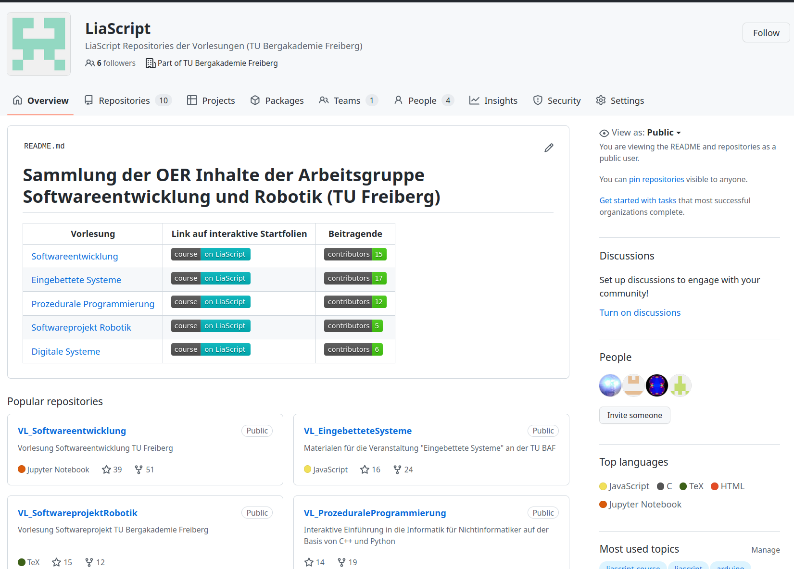
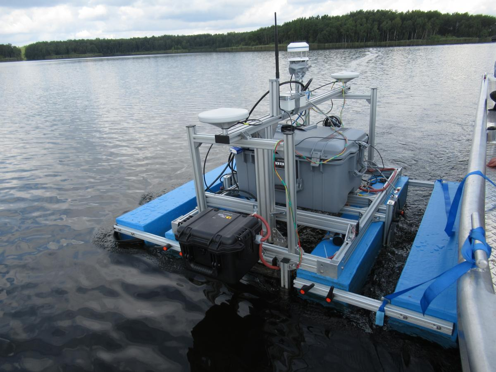

<!--

author:   Sebastian Zug & André Dietrich
email:    zug@ovgu.de   & andre.dietrich@ovgu.de
version:  1.1.6
language: de
narrator: Deutsch Female

import:   https://github.com/liascript/CodeRunner
-->

[](https://liascript.github.io/course/?https://raw.githubusercontent.com/Cross-Lab-Project/presentations/main/HDF_CommunityGroup_2022/CWG_Presentation.md#1)

# Vorlesung Campustag 2023

|      |      |
|  <!-- style="width: 100%" -->     | <h2> Da hat sich seit meiner Zeit nicht viel geändert! </h2>  oder    <h2> Innvoation im universitären Lehrbetrieb </h2>                                |

 <!-- style="width: 15%" -->

-------------------------

Prof. Dr. Sebastian Zug, Technische Universität Bergakademie Freiberg   

---------------------------


## Vorlesungen

> __Traditionell:__ _"... Vorlesungen fallen in die Kategorie Frontalunterricht, bei dem meist mehrere hundert Studenten dem Vortrag eines Professors zuhören. In einigen Fällen liest dieser aus einem Skript oder von Folien vor. ... Daher kann es vorkommen, dass man sich während der Vorlesung ergänzende Notizen zum Vorgetragenen machen muss. Heutzutage verabschieden sich viele Professoren vom alten Bild der Vorlesung und legen Wert darauf, dass Studenten sich durch Fragen in die Veranstaltung einbringen. ... In jedem Fall wird vorausgesetzt, dass der Stoff selbstständig vor- und nachbereitet wird."_ [Link](https://www.studieren.at/uni-abc/vorlesung/)

<details>

<summary>**Interaktives Programmieren**</summary>

```python BuggyCode.py
text = "Campustag 2023"

count = input("Wie oft wollen Sie den Text ausgeben")
print(count)

for i in range(count):
        print(text, end = " ")
```
@LIA.eval(`["main.py"]`, `none`, `python3 main.py`)

</details>


<details>

<summary>**Skripte als Open Educational Ressources**</summary>

> Übersicht zu Vorlesungsinhalten der Informatik/Robotik Grundlagen unter [Link](https://github.com/TUBAF-IfI-LiaScript)

[<!-- style="width:100%" -->](https://github.com/TUBAF-IfI-LiaScript)

</details>

<details>

<summary>**"Extraaufgaben"**</summary>

In der Vorlesung werden die Extraaufgaben als praktische Beiträge der Studierenden vorbereitet, die damit ihre Fähigkeit trainieren, wissen strukturiert weiterzugeben.

</details>


## Übungen 

> __Traditionell:__ _"Übungen dienen der praktischen Anwendung von theoretisch erlerntem Wissen. In der Regel werden sie als Pflichtveranstaltung ergänzend zu einer Vorlesung angeboten. Übungen sind prüfungsimmanent, was bedeutet, dass neben Anwesenheitspflicht die aktive Teilnahme der Studierenden vorausgesetzt wird. Ob und in welcher Form (Referat, schriftliche Ausarbeitung, Klausur) eine zusätzliche Leistung zum Abschluss einer Übung erbracht werden muss, wird von jedem Institut einzeln festgelegt."_ [Link](https://www.studieren.at/uni-abc/uebung/)

<details>
<summary>**Teamarbeit**</summary>

")

</details>

<details>
<summary>**"Remote-Labore"**</summary>


</details>


## Seminare 

> __Traditionell:__ _"Ein Seminar dient der vertiefenden Auseinandersetzung mit einem Thema. In der Regel baut ein Seminar auf einer zuvor besuchten Vorlesung oder einem Proseminar auf.  ... Seminare sind prüfungsimmanente Lehrveranstaltungen, was bedeutet, dass Anwesenheitspflicht herrscht und Studenten aufgefordert sind, sich aktiv an Diskussionen und durch Referate zu beteiligen."_ [Link](https://www.studieren.at/uni-abc/seminar/)

<details>
<summary>__"Forschungsfokus auf unterschiedlichen Ebenen"__</summary>

| Format                  | Fokus                                                              |
|-------------------------|--------------------------------------------------------------------|
| Bachelor Seminar        | Sensorik für die Exploration von Bathymetriekonfigurationen        |
| Master / Diplom Seminar | Simulationsumgebungen für aquatische Robotersysteme                |
| Doktorandenseminar      | Fusion multi-modaler Daten in einem übergreifenden Umgebungsmodell |


 <!-- style="width: 50%" -->

<div class="sketchfab-embed-wrapper"> <iframe title="Riesenstein Scientific-Diving-Center Freiberg" frameborder="0" allowfullscreen mozallowfullscreen="true" webkitallowfullscreen="true" allow="autoplay; fullscreen; xr-spatial-tracking" xr-spatial-tracking execution-while-out-of-viewport execution-while-not-rendered web-share style="width:100%" height="640" src="https://sketchfab.com/models/5f30ea70c20e447eb5e121b51e5ae3f7/embed"> </iframe> <p style="font-size: 13px; font-weight: normal; margin: 5px; color: #4A4A4A;"> <a href="https://sketchfab.com/3d-models/riesenstein-scientific-diving-center-freiberg-5f30ea70c20e447eb5e121b51e5ae3f7?utm_medium=embed&utm_campaign=share-popup&utm_content=5f30ea70c20e447eb5e121b51e5ae3f7" target="_blank" style="font-weight: bold; color: #1CAAD9;"> Riesenstein Scientific-Diving-Center Freiberg </a> by <a href="https://sketchfab.com/sdc_freiberg?utm_medium=embed&utm_campaign=share-popup&utm_content=5f30ea70c20e447eb5e121b51e5ae3f7" target="_blank" style="font-weight: bold; color: #1CAAD9;"> SDC_Freiberg </a> on <a href="https://sketchfab.com?utm_medium=embed&utm_campaign=share-popup&utm_content=5f30ea70c20e447eb5e121b51e5ae3f7" target="_blank" style="font-weight: bold; color: #1CAAD9;">Sketchfab</a></p></div>

</details>

## Zusammenfassung

{{0-1}}
*************************************************

??[](https://www.youtube.com/watch?time_continue=31&v=qbDoeSv3BPs&feature=emb_logo&t=23)


*************************************************

{{1-2}}
> Viel Erfolg beim Aufbruch in die schönste Zeit Ihres Lebens :-)
